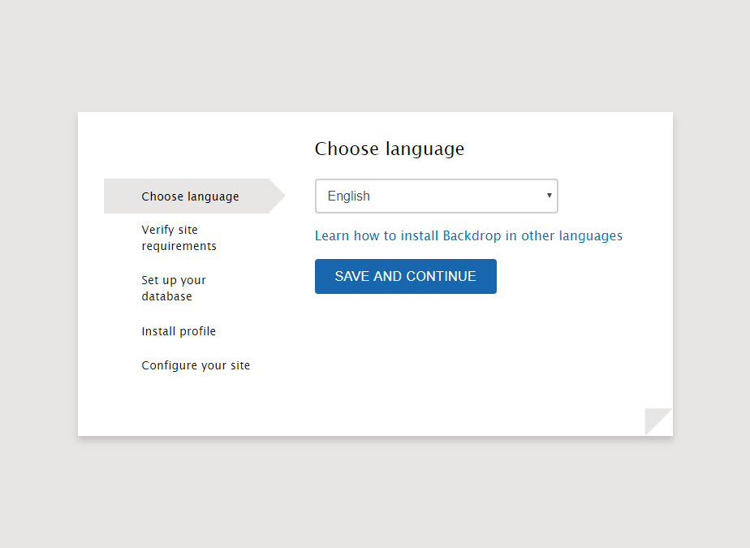
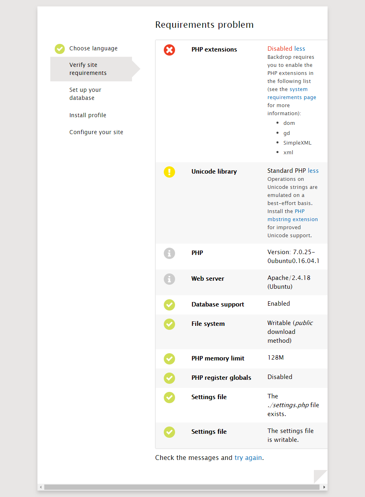
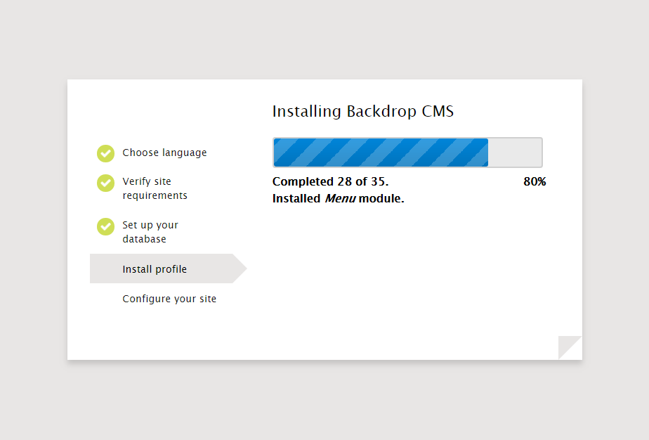
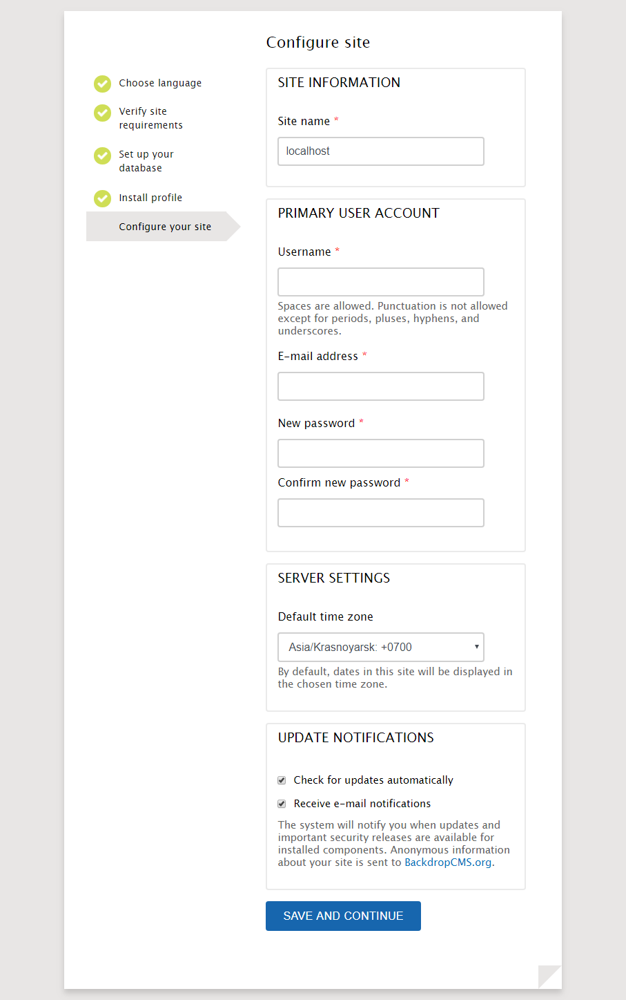
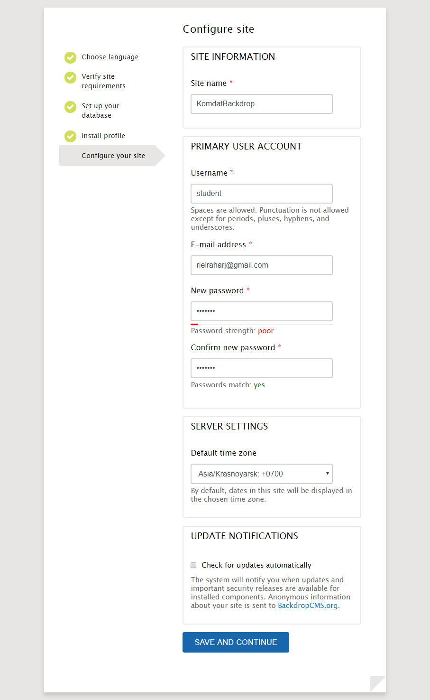
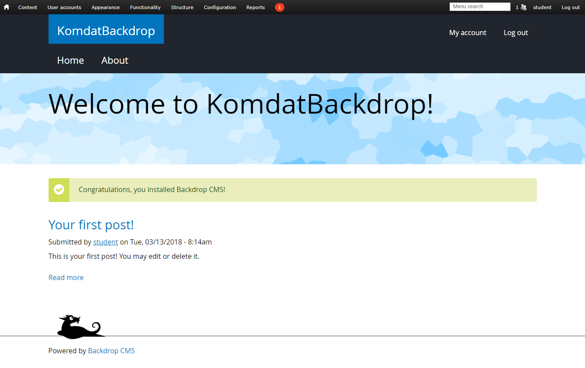

# Aplikasi Web "Backdrop CMS"

#

## Sekilas Tentang Aplikasi

Aplikasi ini adalah...


## Prasyarat Instalasi

- Prasyarat, apa saja yang harus diinstal sebelumnya.
- Langkah instalasi dalam CLI.

## Instalasi LAMP (Linux Apache MySQL PHP)
```bash
# instal SSH
sudo apt update
sudo apt install ssh
```

```bash
# instal Apache, MySQL, PHP


sudo apt install apache2
sudo apt install mysql-server
sudo apt install php
sudo apt install libapache2-mod-php
sudo apt install php-mysql
sudo apt install php-dom
sudo apt install php-gd
sudo apt install php-xml
sudo apt install php-mbstring
sudo service apache2 restart

```
## Instalasi aplikasi web Backdrop CMS
```bash
Membuat Database dan User untuk Backdrop
 mysql -u root -p -v -e "
	CREATE DATABASE backdrop;
	CREATE USER backdrop IDENTIFIED BY 'password';
	GRANT ALL PRIVILEGES ON backdrop.* TO backdrop;"

#Download Backdrop dengan menjalankan perintah seperti dibawah ini!.
-wget "https://github.com/backdrop/backdrop/releases/download/1.9.2/backdrop.zip"

#Kemudian ekstrak backdrop tersebut ke dalam directory web.
- sudo apt install zip
- sudo unzip backdrop.zip -d /var/www/html

#Ubah kepemilikan ke user www-data (webserver)
- sudo chown -R www-data:www-data /var/www/html/backdrop

```

Lakukan instalisasi Backdrop CMS di browser dengan address:
<http://localhost:8888/backdrop>


Pilih bahasa untuk melanjutkan installasi.


Lalu backdrop akan menampilkan  list requirement installasi jika terdapat point-point yang belum terpenuhi.


Masukkan informasi database yang telah dibuat sebelumnya.


Lalu backdrop akan melakukan proses instalasi modul-modulnya.


Masukkan informasi website dan registrasi user account utama.




Jika sudah berhasil maka akan menampilkan website seperti di atas.

## Konfigurasi (opsional)

Setting tambahan yang diperlukan untuk meningkatkan fungsi dan kinerja aplikasi, misalnya:
- batas upload file
- batas memori
- etc.

Plugin untuk fungsi tambahan
- single log-on
- etc.


##  Maintenance (opsional)

Setting tambahan untuk maintenance secara periodik, misalnya:
- hapus tmp sehari sekali
- buat backup seminggu sekali
- etc.


## Otomatisasi (opsional)

Skrip shell untuk otomatisasi instalasi, konfigurasi, dan maintenance.


## Cara Pemakaian

- Tampilan aplikasi web
- Fungsi-fungsi utama
- Isi dengan data real/dummy (jangan kosongan) dan sertakan beberapa screenshot


## Pembahasan

- Pendapat anda tentang aplikasi web ini
	- pros:
	- cons:
- Bandingkan dengan aplikasi web kelompok lain yang sejenis


## Referensi

Cantumkan tiap sumber informasi yang anda pakai.