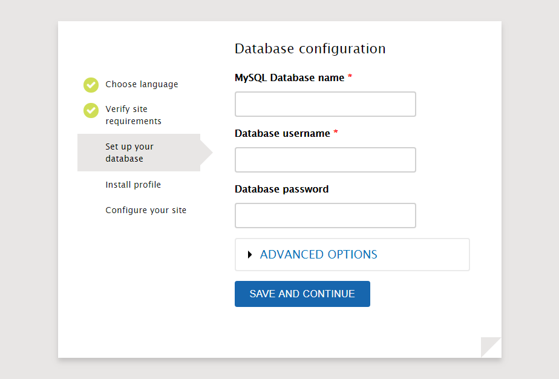

# Aplikasi Web "Backdrop CMS"

#

## Sekilas Tentang Aplikasi

Aplikasi ini adalah aplikasi content management sistem yang gratis dan open source dituliskan dalam bahasa PHP. Backdrop CMS merupakan fork dari Drupal.Backdrop CMS difokuskan memberikan CMS yang terjangkau tapi cukup lengkap untuk usaha menegah kebawah, non profil, institusi educational, dan organisasi lainnya. 


## Prasyarat Instalasi


## Instalasi LAMP (Linux Apache MySQL PHP)
```bash
# instal SSH
sudo apt update
sudo apt install ssh
```

```bash
# instal Apache, MySQL, PHP


sudo apt install apache2
sudo apt install mysql-server
sudo apt install php
sudo apt install libapache2-mod-php
sudo apt install php-mysql
sudo apt install php-dom
sudo apt install php-gd
sudo apt install php-xml
sudo apt install php-mbstring
sudo service apache2 restart

```
## Instalasi aplikasi web Backdrop CMS
```bash
Membuat Database dan User untuk Backdrop
 mysql -u root -p -v -e "
	CREATE DATABASE backdrop;
	CREATE USER backdrop IDENTIFIED BY 'password';
	GRANT ALL PRIVILEGES ON backdrop.* TO backdrop;"

#Download Backdrop dengan menjalankan perintah seperti dibawah ini!.
-wget "https://github.com/backdrop/backdrop/releases/download/1.9.2/backdrop.zip"

#Kemudian ekstrak backdrop tersebut ke dalam directory web.
- sudo apt install zip
- sudo unzip backdrop.zip -d /var/www/html

#Ubah kepemilikan ke user www-data (webserver)
- sudo chown -R www-data:www-data /var/www/html/backdrop

```

Lakukan instalisasi Backdrop CMS di browser dengan address:
<http://localhost:8888/backdrop>

##### Pilih bahasa untuk melanjutkan installasi.


##### Lalu backdrop akan menampilkan  list requirement installasi jika terdapat point-point yang belum terpenuhi.


##### Masukkan informasi database yang telah dibuat sebelumnya.


##### Lalu backdrop akan melakukan proses instalasi modul-modulnya.


##### Masukkan informasi website dan registrasi user account utama.


##### Jika sudah berhasil maka akan menampilkan website seperti di atas.


## Konfigurasi (opsional)

Setting tambahan yang diperlukan untuk meningkatkan fungsi dan kinerja aplikasi, misalnya:
- batas upload file
- batas memori
- etc.

Plugin untuk fungsi tambahan
- single log-on
- etc.


##  Maintenance (opsional)

Setting tambahan untuk maintenance secara periodik, misalnya:
- hapus tmp sehari sekali
- buat backup seminggu sekali
- etc.


## Otomatisasi (opsional)

Skrip shell untuk otomatisasi instalasi, konfigurasi, dan maintenance.


## Cara Pemakaian

Tampilan aplikasi web

#### Halaman login.


Dalam halaman login akan ditampilkan:

- Username or email.
- Password.
###### Create New Account: untuk membuat acccount baru.
###### Reset password: untuk mereset password jika kita lupa password.

#### Create Post


- Tittle: menambahkan judul postingan.
- Tags: menandai siapa yang akan di tandai dalam postingan.
- Body: kalimat-kalimat yang akan di buat.
- Formating option: untuk menentukan filtered HTML atau Full HTML. 
- Image: Memasukan gambar dalam postingan.
- Save: untuk menyimpan postingan dan mempublikasikannya.

#### Hasil postingan yang telah dibuat.

Postingan akan ditempatkan dalam home.

#### Edit Post

Edit yang ingin kita ubah dalam postingan.

#### Hasil setelah diedit.


#### Comment post.

jika ingin menambahkan komentar dalam suatu postingan.

#### Hasil setelah postingan.

Setelah ditambahkan komentar maka tampilan akan seperti diatas.

#### Front Page Post.

Beberapa postingan yang telah dibuat akan ditampilan dalam Front page.

## Pembahasan

- Pendapat anda tentang aplikasi web ini
	- pros:
		-  Waktu pembuatan website cepat, karena tidak menulis kode dan merancang database.
		- Isi website bisa diubah oleh orang yang tidak menguasai pemprograman web(HTML, PHP, JS, dll).
		- Banyak CMS yang tersedia gratis dan open source.
		- Banyak tersedia ekstensi (Modul, Template, dll) untuk penambahan fitur dengan cepat.

	- cons:
		- Bentuk dan fitur website mirip dengan website yang lain yang dibuat dengan CMS yang sama.
		- Fitur dan fungsi website terbatas, tidak 100% sesuai dengan pemilik website.
		- Terbatasnya edit kode HTML ataupun PHP.
		- Untuk website kecil penggunaan CMS berlebihan, dan webseite enterprise, menggunakan CMS fiturnya terlalu terbatas.
		

- Bandingkan dengan aplikasi web kelompok lain yang sejenis


## Referensi
https://maseadi.wordpress.com/2013/01/25/kelebihan-kekurangan-cms/
github.com/auriza

Cantumkan tiap sumber informasi yang anda pakai.